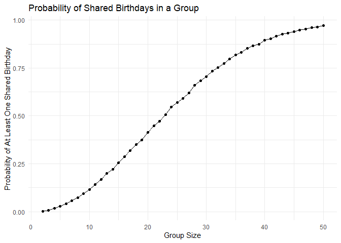
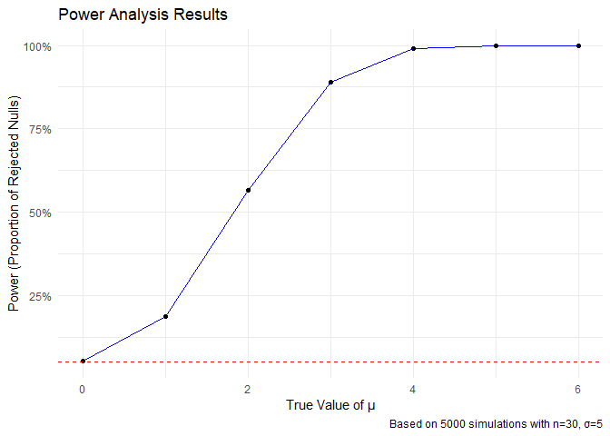
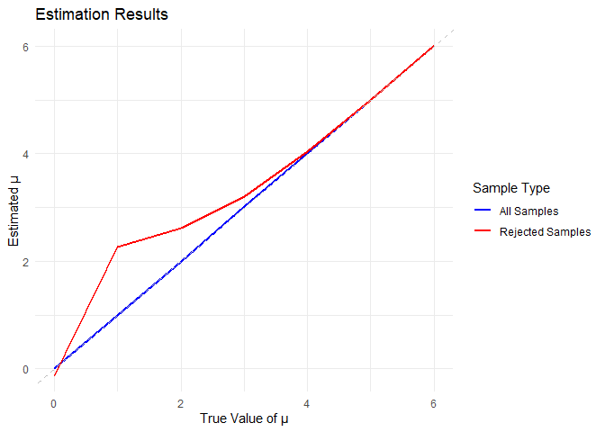
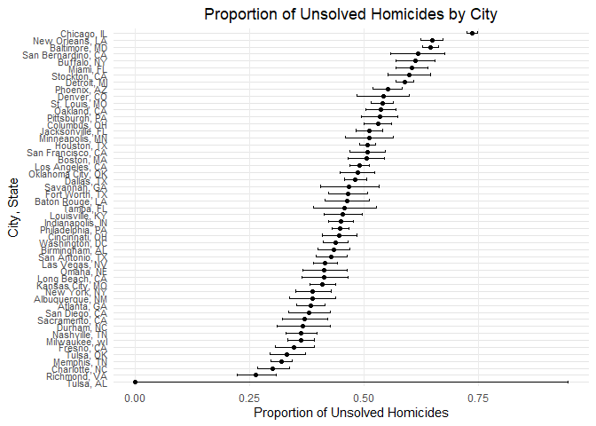

p8105_hw5_yh3683
================
Yining He
2024-11-11

# Problem 1

Check if at least two people share a birthday

``` r
birthday_simulation <- function(n) {
  birthdays <- sample(1:365, n, replace = TRUE) 
  return(any(duplicated(birthdays))) 
}
```

Run 10,000 simulations for group sizes 2-50, calculate shared birthday
probability for each size, and plot the probabilities against group
sizes.

<!-- -->

The plot shows that the probability of at least two people sharing a
birthday increases rapidly with group size, surpassing 50% at around 23
people, demonstrating the Birthday Paradox.

# Problem 2

    ## Warning in geom_point(linewidth = 3): Ignoring unknown parameters: `linewidth`

<!-- -->

The plot demonstrates a positive relationship between effect size (μ)
and statistical power. At small μ values, the test has low power and
often fails to detect true effects. As μ increases, power rises rapidly
and approaches 100%, indicating the test becomes increasingly effective
at detecting larger effects.

    ## 
    ## 
    ## Table: Power at different effect sizes
    ## 
    ## | True μ|Power  |
    ## |------:|:------|
    ## |      0|5.4%   |
    ## |      1|19.0%  |
    ## |      2|56.4%  |
    ## |      3|88.6%  |
    ## |      4|99.0%  |
    ## |      5|100.0% |
    ## |      6|100.0% |

<!-- -->

The plot shows that the average estimate of μ for all samples (blue)
follows the true value of μ, while the average estimate for only those
samples where the null was rejected (red) is consistently higher,
particularly for small effect sizes. This phenomenon, known as selection
bias, occurs because rejected samples are more likely to have estimates
farther from zero, leading to an upward bias in the average estimate for
rejected tests.

# Problem 3

    ## Rows: 52179 Columns: 12
    ## ── Column specification ────────────────────────────────────────────────────────
    ## Delimiter: ","
    ## chr (9): uid, victim_last, victim_first, victim_race, victim_age, victim_sex...
    ## dbl (3): reported_date, lat, lon
    ## 
    ## ℹ Use `spec()` to retrieve the full column specification for this data.
    ## ℹ Specify the column types or set `show_col_types = FALSE` to quiet this message.

The dataset contains information on 52179criminal homicides from the
past decade across 50 large U.S. cities, with 12 columns. It includes
details about uid, reported_date, victim_last, victim_first,
victim_race, victim_age, victim_sex, city, state, lat, lon, disposition.

``` r
homicide <- homicide %>%
  mutate(
    city_state = str_c(city, state, sep = ", "),
    solved = !(disposition %in% c("Closed without arrest", "Open/No arrest"))
  )

city_summary <- homicide %>%
  group_by(city_state) %>%
  summarize(
    total_homicides = n(),
    unsolved_homicides = sum(!solved),
    .groups = "drop"
  )

baltimore_data <- city_summary %>%
  filter(city_state == "Baltimore, MD")

baltimore_test <- prop.test(
  x = baltimore_data$unsolved_homicides,
  n = baltimore_data$total_homicides
)

baltimore_result <- baltimore_test %>%
  broom::tidy() %>%
  select(estimate, conf.low, conf.high)
baltimore_result %>% knitr::kable()
```

|  estimate |  conf.low | conf.high |
|----------:|----------:|----------:|
| 0.6455607 | 0.6275625 | 0.6631599 |

In Baltimore, approximately 64.6% of homicides remain unsolved (95% CI:
62.8%, 66.3%).

    ## Rows: 52179 Columns: 12
    ## ── Column specification ────────────────────────────────────────────────────────
    ## Delimiter: ","
    ## chr (9): uid, victim_last, victim_first, victim_race, victim_age, victim_sex...
    ## dbl (3): reported_date, lat, lon
    ## 
    ## ℹ Use `spec()` to retrieve the full column specification for this data.
    ## ℹ Specify the column types or set `show_col_types = FALSE` to quiet this message.

    ## Warning: There was 1 warning in `mutate()`.
    ## ℹ In argument: `test_results = map2(unsolved, total, ~prop.test(x = .x, n =
    ##   .y))`.
    ## Caused by warning in `prop.test()`:
    ## ! Chi-squared approximation may be incorrect

    ## # A tibble: 6 × 6
    ##   city_state      total unsolved estimate conf.low conf.high
    ##   <chr>           <int>    <int>    <dbl>    <dbl>     <dbl>
    ## 1 Albuquerque, NM   378      146    0.386    0.337     0.438
    ## 2 Atlanta, GA       973      373    0.383    0.353     0.415
    ## 3 Baltimore, MD    2827     1825    0.646    0.628     0.663
    ## 4 Baton Rouge, LA   424      196    0.462    0.414     0.511
    ## 5 Birmingham, AL    800      347    0.434    0.399     0.469
    ## 6 Boston, MA        614      310    0.505    0.465     0.545

<!-- -->
